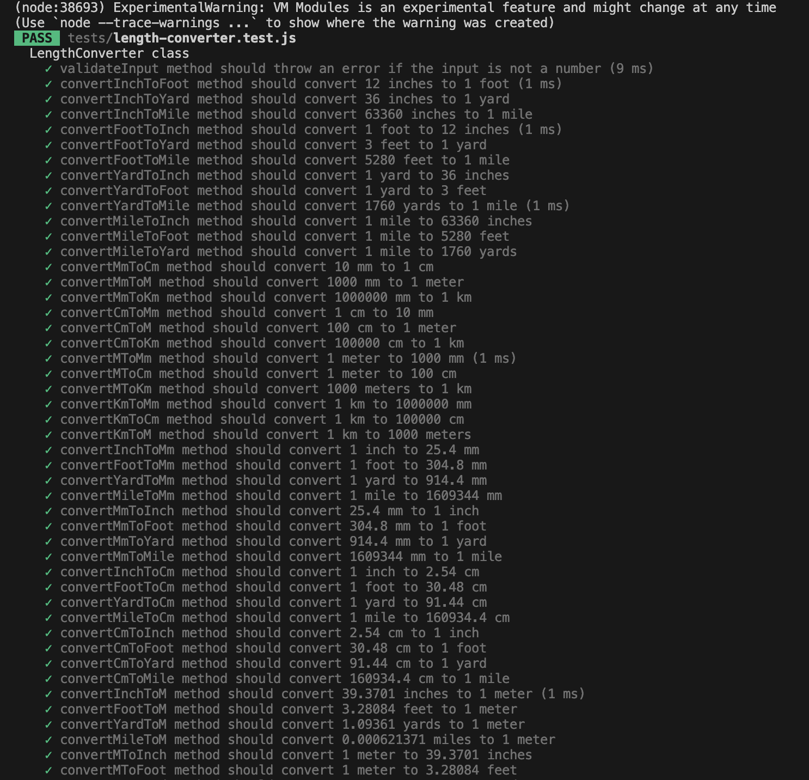
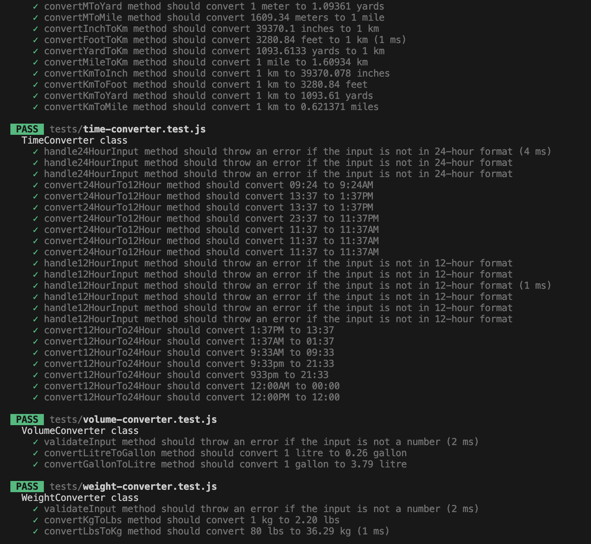
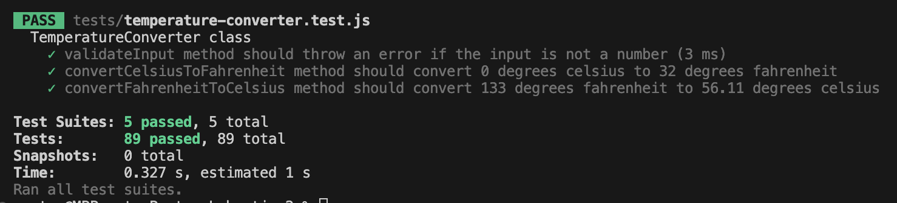

# Test report
## Tested using the testframework jest
All methods in all 5 classes have been tested.
This includes:  
Length converter  
Temperature converter  
Time converter  
Volume converter  
weight converter  

Test includes validation of input data(arguments) sent to the methods which trows an error if the input data is not valid.  
The tests also make sure that all the classes and their methods convert the data as it is intended to do.

